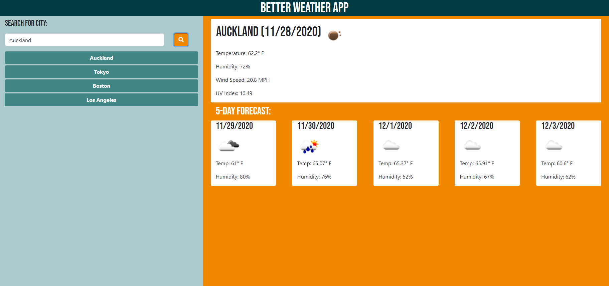

# Better Weather Tracker

This project aimed to create a weather dashboard that allows a user to search a city and see the weather for that city. The application allows users to save their past search results via dynamically generated buttons and click those buttons to view the weather for that city again. The weather application also generates the UV index for that area and shows whether conditions are favorable, moderate or severe by color coding the text.

This application features dynamically updated HTML and CSS, is powered by JQuery and JavaScript. This application features AJAX calls from 3 Third-Party APIs from [OpenWeatherMap.org](https://www.openweathermap.org/).

## Deployment
[Live Website](https://jonnahmarie.github.io/Better-Weather-App/)

## Screenshot
